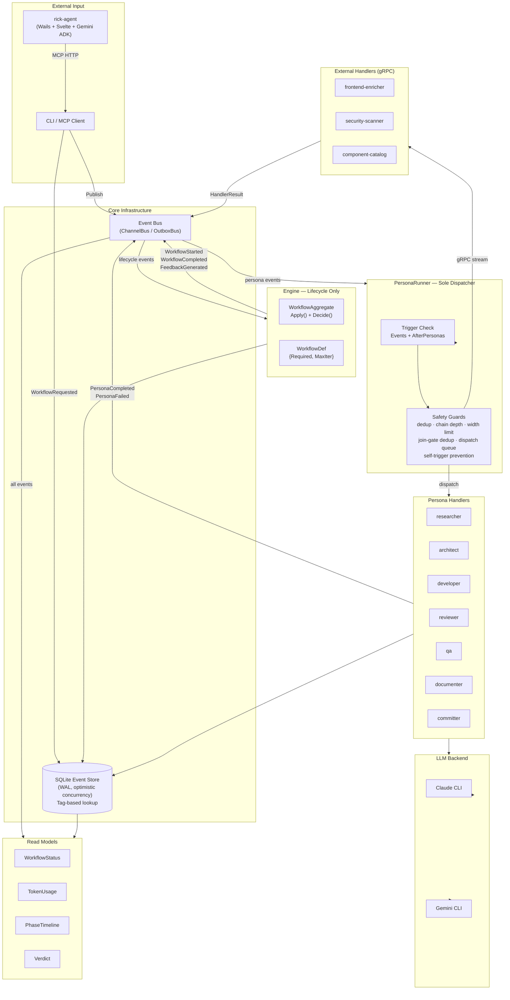
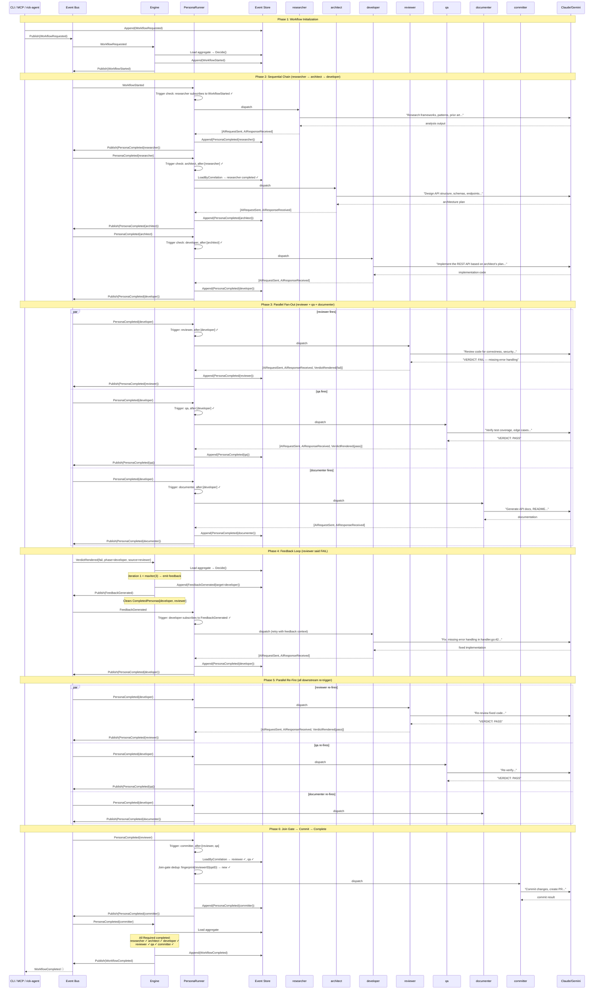
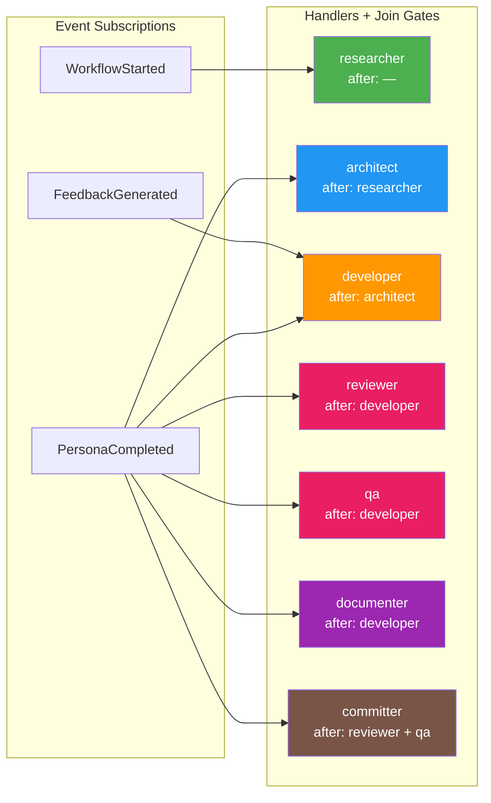
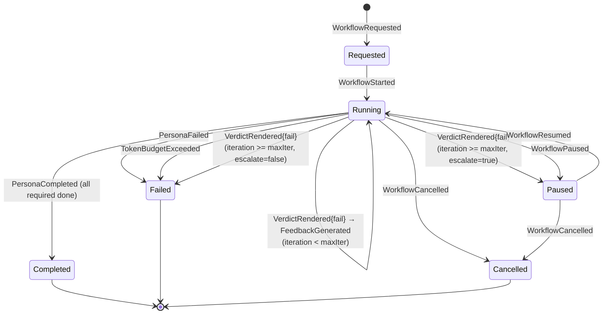

# Rick Architecture

## System Overview



## Event Flow — Default Workflow Example

**User prompt:** `"Build a REST API for user management"`



## Trigger Configuration (All Handlers)



## Feedback Loop State Machine



**Resume-after-escalation:** When a paused workflow is resumed (WorkflowResumed), the Engine detects the phase that hit MaxIterations, bumps the limit by 1, and re-emits FeedbackGenerated. This triggers the developer to re-run with operator guidance visible in the correlation chain.

## Component Responsibilities

```
┌─────────────────────────────────────────────────────────────────┐
│                  CLI / MCP / rick-agent                          │
│  Accepts user prompt → creates WorkflowRequested event          │
│  rick-agent: Wails desktop app → Gemini ADK → MCP tools         │
└──────────────────────────┬──────────────────────────────────────┘
                           │
┌──────────────────────────▼──────────────────────────────────────┐
│                      Event Bus                                  │
│  Pub/Sub with middleware (logging, metrics, dead letter, retry)  │
│  ChannelBus (in-process) · OutboxBus (transactional outbox)     │
└───┬──────────────┬──────────────┬───────────────────────────────┘
    │              │              │
    ▼              ▼              ▼
┌────────┐  ┌───────────┐  ┌──────────────┐
│ Engine │  │ Persona   │  │ Projections  │
│        │  │ Runner    │  │              │
│ WHAT:  │  │ WHAT:     │  │ WHAT:        │
│ Life-  │  │ Dispatch  │  │ Read models  │
│ cycle  │  │ handlers  │  │ for queries  │
│ only   │  │           │  │              │
│        │  │ HOW:      │  │ HOW:         │
│ HOW:   │  │ Trigger   │  │ Catch-up +   │
│ Aggre- │  │ matching, │  │ live sub     │
│ gate   │  │ join gate │  │              │
│ Decide │  │ check,    │  └──────────────┘
│        │  │ safety    │
│ EMITS: │  │ guards    │
│ Started│  │           │
│ Done   │  │ EMITS:    │
│ Failed │  │ Persona   │
│ Feed-  │  │ Completed │
│ back   │  │ Persona   │
└────────┘  │ Failed    │
            └─────┬─────┘
                  │
    ┌─────────────┼─────────────┐
    ▼             ▼             ▼
┌────────┐  ┌────────┐   ┌──────────┐
│Handler │  │Handler │   │ Backend  │
│Registry│  │  impl  │   │ (Claude/ │
│        │  │ (AI +  │   │  Gemini) │
│ Name→H │  │ prompt │   │          │
│ lookup │  │ build) │   │ CLI sub- │
└────────┘  └────────┘   │ process  │
                          └──────────┘

┌─────────────────────────────────────────────────────────────────┐
│                    SQLite Event Store                            │
│  Append-only · Optimistic concurrency · WAL mode                │
│  LoadByCorrelation (cross-aggregate join queries)               │
│  LoadByTag (business key → correlation lookup)                  │
│  Snapshots · Dead letter queue                                  │
└─────────────────────────────────────────────────────────────────┘
```

## Workflow Definitions

### Built-in Workflows

| Workflow | Required Personas | MaxIter | Escalate |
|----------|-------------------|---------|----------|
| `default` | researcher, architect, developer, reviewer, qa, committer | 3 | no |
| `develop-only` | developer, reviewer | 3 | no |
| `workspace-dev` | workspace, context-snapshot, developer, reviewer, qa, committer | 3 | yes |
| `pr-review` | pr-workspace, pr-jira-context, pr-architect, pr-reviewer, pr-qa, pr-consolidator, pr-cleanup | 1 | no |
| `pr-feedback` | workspace, feedback-analyzer, context-snapshot, developer, reviewer, committer | 3 | yes |
| `jira-dev` | jira-context, researcher, architect, developer, reviewer, qa, committer | 3 | yes |
| `ci-fix` | developer, reviewer, qa, committer | 2 | yes |
| `plan-btu` | confluence-reader, codebase-researcher, plan-architect, estimator, confluence-writer | 3 | yes |

### Plugin-Provided Workflows (dynamically registered via gRPC)

| Workflow | Required Personas | Plugin | MaxIter |
|----------|-------------------|--------|---------|
| `plan-jira` | page-reader, project-manager, jira-task-creator | rick-jira-planner | 3 |
| `task-creator` | task-creator | rick-jira-planner | 1 |

## Before-Hooks (External Enrichment)

External systems can insert into the handler chain without modifying handler code. Hooks inject additional join conditions at runtime via `WithBeforeHook`.

```
Without hook:  architect → developer
With hook:     architect → frontend-enricher → developer

developer's declared AfterPersonas: ["architect"]
+ hook injection:                   ["frontend-enricher"]
= effective join:                   ["architect", "frontend-enricher"]
```

## Dispatch Queue (Priority Ordering)

Each handler gets a per-correlation priority queue. Events for the same (handler, workflow) are serialized — no concurrent execution. When multiple events are pending, highest priority processes first.

| Priority | Event Type | Value |
|----------|-----------|-------|
| Highest | `OperatorGuidance` | 0 |
| High | `FeedbackGenerated` | 10 |
| Normal | `PersonaCompleted` / `PersonaFailed` | 20 |
| Default | `WorkflowStarted`, others | 30 |

## Tag-Based Correlation Lookup

The Engine auto-indexes business keys from `WorkflowRequested` as tags. External systems discover workflows by business identifier instead of UUID.

```go
// Discover workflow by Jira ticket
ids, _ := store.LoadByTag(ctx, "ticket", "PROJ-123")    // → ["corr-abc"]

// Discover by repo+branch
ids, _ := store.LoadByTag(ctx, "repo_branch", "org/repo:main")

// Discover by source
ids, _ := store.LoadByTag(ctx, "source", "jira:PROJ-123")
```

| Tag Key | Extracted From | Example Value |
|---------|---------------|---------------|
| `source` | `WorkflowRequested.Source` | `"jira:PROJ-123"` |
| `ticket` | `WorkflowRequested.Ticket` | `"PROJ-123"` |
| `repo` | `WorkflowRequested.Repo` | `"acme/myapp"` |
| `repo_branch` | `Repo:BaseBranch` | `"acme/myapp:main"` |
| `workflow_id` | `WorkflowRequested.WorkflowID` | `"default"` |

## gRPC Service Discovery

External systems connect via bidirectional gRPC streams. The stream lifecycle IS the registration — no separate service registry needed.

```
External System                         Rick (PersonaService)
     │                                        │
     │── HandleStream (open) ────────────────>│
     │   HandlerRegistration{                 │
     │     name: "frontend-enricher"          │
     │     events: ["persona.completed"]      │  Creates proxy handler
     │     after: ["architect"]               │  Wires bus subscriptions
     │     hooks: ["developer"]               │  Registers before-hook
     │   }                                    │
     │<── RegistrationAck{ok} ───────────────│
     │                                        │
     │   ... architect completes ...          │
     │                                        │
     │<── DispatchRequest{event} ────────────│  PersonaRunner trigger + join ✓
     │                                        │
     │   ... process event ...                │
     │                                        │
     │── HandlerResult{events} ──────────────>│  PersonaCompleted emitted
     │                                        │
     │── stream close ───────────────────────>│  Auto-deregistration
```

### Dispatch routing

```
CompositeDispatcher
  ├── LocalDispatcher    → built-in personas (in-process, <1ms)
  └── StreamDispatcher   → external handlers (gRPC stream, ~10-50ms)
       ├── "frontend-enricher" → Python service
       └── "security-scanner"  → Go microservice
```

### Proto contract

```protobuf
service PersonaService {
  rpc HandleStream(stream HandlerMessage) returns (stream DispatchMessage);
}

message HandlerRegistration {
  string name = 1;
  repeated string event_types = 2;        // what wakes this handler
  repeated string after_personas = 3;      // join condition
  repeated string before_hook_targets = 4; // personas to gate
}
```

### Reconnecting client

`Client.Run(ctx)` (`internal/grpchandler/client.go`) provides production-grade stream resilience:

```go
client := grpchandler.NewClient(conn, grpchandler.ClientConfig{
    Name:          "frontend-enricher",
    EventTypes:    []string{"persona.completed"},
    AfterPersonas: []string{"architect"},
    Handler:       myHandlerFunc,
})
go client.Run(ctx) // reconnects automatically until ctx cancelled
```

- Exponential backoff: BaseDelay(1s) x 2^attempt, capped at MaxDelay(30s)
- Automatic re-registration on each reconnect
- Configurable MaxRetries (0 = unlimited)

Safety guards (self-trigger, chain depth, dedup, join conditions, priority queue) all remain in PersonaRunner. External handlers are pure event processors — Rick owns all choreography logic.
