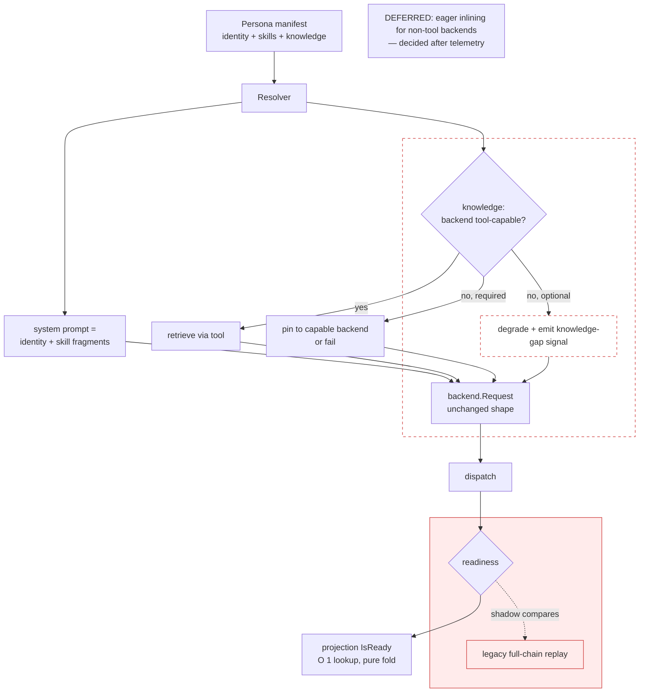
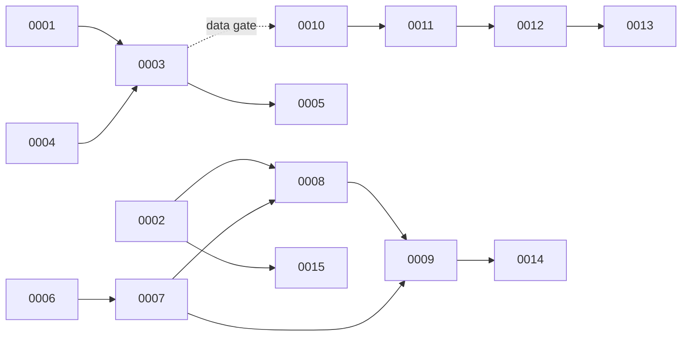

# Epic — Persona Extensibility & Dispatch Stability

> **OST format.** This file is the **Onramp** (epic body, stands alone). The
> **Spec** is `../persona-extensibility-and-dispatch-redesign.md` (+ the
> `-impl-plan.md` appendix). The **Tasks** are the numbered files in this
> directory; each cites a Spec section.

## Summary

Personas (the AI roles that drive each workflow phase) can only be added or
changed by editing Go source and recompiling, and there is no way to compose
shared behavior or attach per-repo knowledge. Separately, dispatch readiness is
recomputed by replaying the full event chain on every attempt, which has produced
a recurring class of workflows that strand silently. This epic delivers
**data-driven composable personas** (identity + skills + knowledge, no recompile)
and replaces the replay with a **single-writer readiness projection**, gated by
**telemetry** that first proves which stall class is real.

## Scope

**In:**
- Manifest-defined personas composed from reusable **skills** and per-repo
  **knowledge** packs, loaded without recompile, for existing handlers.
- A readiness **projection** (read model) that replaces per-dispatch chain replay,
  rolled out shadow → active behind a flag.
- **Telemetry**: dwell-time per blocked state; updater-liveness; knowledge-gap
  signal.
- Migration of the 13 category reviewers to manifests as the first consumer.

**Out (explicit):**
- New deterministic (non-AI) handlers and new workflow graph topology — manifests
  do not cover these (separate future track).
- Eager inlining of knowledge for backends without tool support — deferred until
  telemetry quantifies the gap; until then `required` knowledge pins to a
  tool-capable backend or fails.
- Replacing the multi-backend adapter or adopting an external agent framework
  (analyzed and rejected in the Spec).
- Operator-editable safety/runtime knobs (permission-skipping, plain-text mode,
  backend selection, timeouts) — these stay code-owned.

## Approach

A persona becomes a manifest with three layers — **identity** (who), **skills**
(how), **knowledge** (what it knows). At dispatch a resolver composes the system
prompt and negotiates knowledge delivery against backend capability (tool-based
retrieval where supported). The manifest owns **prompt composition only**; safety
knobs remain in code. In parallel, dispatch readiness moves from full-chain
replay to a projection that is a pure fold over the existing event log
(reconstructable, idempotent), shipped in shadow mode until it agrees with the
legacy path, then promoted. Everything is flag-gated and defaults to current
behavior.

Shaded/dashed: the **optional-knowledge degrade path** (eager inlining deferred)
and the **legacy replay** (retired only after the projection proves equivalent in
shadow). See Spec Section 3 for the resolver and Section 3.5 for the projection.

## Acceptance Criteria

- [ ] A category reviewer runs from a manifest with prompt behavior equivalent to
      or better than today (golden-file proof); shared boilerplate is deduplicated.
- [ ] Adding/recomposing an existing persona requires **no recompile** (drop a
      manifest, restart); a manifest that sets a safety/runtime knob is **rejected
      loudly** at startup.
- [ ] Telemetry shows dwell distribution by stall reason over real traffic; a
      stalled readiness updater **pages** rather than stranding silently.
- [ ] The readiness projection agrees with the legacy path across real traffic
      (zero unexplained divergence) before it is trusted; the long-latent
      "stale-guard never clears" stall becomes an observable state with a
      regression test that fails today and passes after.
- [ ] Every change defaults to current behavior; each has a seconds-fast rollback.

## Risks

- **Scope fusion** (the most likely failure) — the persona work and the dispatch
  work get entangled in one un-reviewable change, so a dispatch regression blocks
  unrelated persona work. *Mitigation:* hard boundary — persona tasks touch zero
  dispatch/readiness code; enforced as a PR-diff review gate.
- **Relocated single point of failure** — trusting one readiness projection means
  a stalled updater strands everything. *Mitigation:* poison-pill quarantine +
  apply-lag liveness alert + rebuild-from-log; validated free in shadow mode.
- **Backend-dependent behavior** — knowledge only on tool-capable backends makes
  a persona's behavior vary by backend. *Mitigation:* explicit `required` vs
  `optional` criticality; `required` pins or fails, never silently no-ops.
- **Manifest schema churn** — *Mitigation:* `schema_version` + strict startup
  validator from day one.

## Child Issues

Ordering and dependencies:

| # | Title | Track | SP | Status | Depends on |
|---|---|---|---|---|---|
| [0001](0001-roundrobin-attribution.md) | Backend attribution on rotation | Foundations | 3 | Ready | — |
| [0002](0002-backend-capabilities.md) | Backend capability interface | Foundations | 3 | Ready | — |
| [0003](0003-dwell-time-analytic.md) | Dwell-time projection | Telemetry | 5 | Blocked | 0001, 0004 |
| [0004](0004-dispatch-started-event.md) | Dispatch-started event | Telemetry | 2 | Ready | — |
| [0005](0005-stale-dwell-alert.md) | Stall/dwell alert | Telemetry | 2 | Blocked | 0003 |
| [0006](0006-manifest-schema-validator.md) | Manifest schema + validator | Persona registry | 5 | Ready | — |
| [0007](0007-persona-resolver-registry.md) | Resolver + dual-source registry | Persona registry | 8 | Blocked | 0006 |
| [0008](0008-knowledge-layer-lazy-mcp.md) | Knowledge layer + negotiation | Persona registry | 8 | Blocked | 0001, 0002, 0007 |
| [0009](0009-migrate-pr-reviewers.md) | Migrate category reviewers | Persona registry | 5 | Blocked | 0007, 0008 |
| [0010](0010-runtime-state-projection.md) | Readiness projection | Dispatch | 8 | Blocked | 0003 (data gate) |
| [0011](0011-projection-shadow-mode.md) | Projection shadow mode | Dispatch | 5 | Blocked | 0010 |
| [0012](0012-projection-flip-active.md) | Flip projection active | Dispatch | 2 | Blocked | 0011 |
| [0013](0013-retire-legacy-join.md) | Retire legacy readiness path | Dispatch | 5 | Blocked | 0012 |
| [0014](0014-l2-new-persona-manifest.md) | New persona via manifest (stretch) | Persona registry | 8 | Stretch | 0009 |
| [0015](0015-api-backend.md) | API backend adapter (optional) | Backend | 5 | Optional | 0002 |

**The hard boundary:** tasks 0006–0009 and 0014 must not edit the dispatch
readiness function or the dispatcher's admission logic. The PR diff must contain
no hunks there. *(Caveat from review F8: `PRConsolidator` resolves its persona
outside `AIHandler` — route it through a shared resolver or scope it out; see
0007.)*

## Pre-implementation review

Two independent CLI reviewers stress-tested these docs against the code before
any implementation. Findings (all re-verified at file:line) and their
resolutions are in **[REVIEW-FINDINGS.md](REVIEW-FINDINGS.md)**. The material
outcomes folded back into the tasks:

- **Track B is snapshot-backed, not a pure fold** (F1/F2): the WorkflowDef
  topology is not in the durable log, so the projection persists a def snapshot
  at `WorkflowStarted` and folds `WorkflowRetried` — see 0010 and Spec
  Section 3.5.1.
- **A backend selection API** (`Select`/capability-filtered) is a real shared
  dependency of 0001 and 0008 (F4/F5).
- **Shadow divergence moves off the dispatch hot path** into the projection
  apply (F6) — see 0011.
- Several task-level infeasibilities corrected in-place (F3, F8, F9, F10, F11,
  F13, F15).
