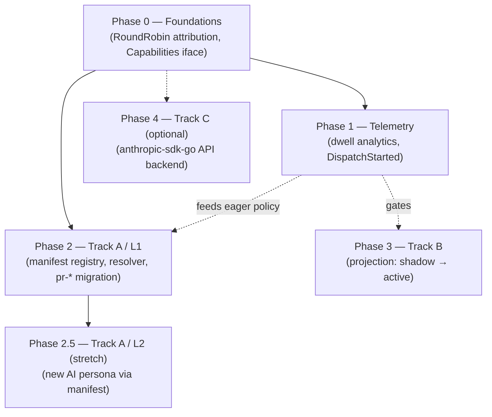

# Implementation Plan: Persona Extensibility & Dispatch Stability

> Derived from `persona-extensibility-and-dispatch-redesign.md` (revised after
> two reviews). Read that first for rationale; this document is the executable
> sequencing. **Status: PROPOSAL — not started.**

## Conventions for every phase

- **Pre-commit gate:** `make check` (lint + test + test-race) must pass — not
  bare `go test`. Race detector is mandatory for all dispatch/projection work.
- **Failing test first** for every bug-class behavior we claim to fix (the wedge
  regressions especially): write it, watch it fail for the right reason, then
  fix.
- **Flags default to current behavior.** Every phase ships dark.
- **Deploy:** `go build -o ~/.local/bin/rick`, then restart the systemd unit;
  triage against `~/.local/share/rick/rick.db`, not the dev copy.
- **The hard boundary:** Track A (Phases 2) touches **zero** lines of
  `workflow_resolver.go:checkJoinCondition` or `persona_runner.go` dispatch
  logic. Enforced as a PR review gate (the diff must not include those hunks).

Relative sizing: **S** ≈ ½–1 day, **M** ≈ 2–4 days, **L** ≈ 1–2 weeks.

---

## Dependency graph

**Parallelizable:** Phase 1 (Telemetry) and Phase 2 (Track A) run concurrently
after Phase 0 — they share no files. Phase 3 (Track B) is **gated** on Phase 1
producing dwell data.

---

## Phase 0 — Foundations & guardrails

**Objective:** small, additive prerequisites that unblock telemetry readability
and knowledge negotiation. No behavior change.

| # | Work item | Files | Size |
|---|---|---|---|
| 0.1 | **RoundRobin attribution fix** — record the *chosen inner backend* in `AIRequestSent`/`AIResponseReceived`, not the composite `round-robin(...)` name. Without it, Phase 1 dwell/telemetry on review-phase handlers is unreadable. | `internal/backend/round_robin.go`, the AI handler call site emitting `AIRequestSent` (`internal/handler/ai.go`) | M |
| 0.2 | **`backend.Capabilities()`** — additive interface method; each backend returns its capability matrix (MCP, SystemPrompt, SessionResume, TokenAccounting, ReasoningEffort). Also lets the resolver stop sending no-op `MCPConfig`/`Effort` to backends that ignore them. | `internal/backend/backend.go` (+ every backend impl: claude/gemini/codex/opencode/antigravity, round_robin delegates) | M |

**Exit criteria:** `make check` green; a review workflow shows the real backend
name in `AIRequestSent`; `Capabilities()` covered by a table test asserting the
documented matrix.

**Rollback:** both are additive; revert commits independently.

---

## Phase 1 — Telemetry (parallel; prerequisite for Phase 3)

**Objective:** quantify *which* wedge class still strands workflows, and produce
the `knowledge_unavailable` signal that decides the deferred eager policy. No
dispatch-logic change.

| # | Work item | Files | Size |
|---|---|---|---|
| 1.1 | **Dwell-time analytic** — a projection that consumes existing `DispatchDropped` (already shipped) + `PersonaCompleted`/`PersonaFailed` and computes time-in-blocked-state per `(correlationID, persona, drop_reason)`. Derivable from the existing log — **no dispatch change**. Exposes `dispatch_dwell_seconds{state,persona}` histogram. | new `internal/projection/dwell.go`; register in `internal/cli/serve.go` projection runner | M |
| 1.2 | **`DispatchStarted` event (additive emit)** — non-AI handlers have no "started" signal (AI handlers emit `AIRequestStarted`). Emit `DispatchStarted` at the top of `executeDispatch` for execution-duration telemetry. **Additive observability only — does not touch readiness/join logic.** | `internal/event/` (new type), `internal/engine/persona_runner.go` (emit only) | S |
| 1.3 | **Stale/dwell alert** — alert on any correlation with a persona blocked past an SLO threshold. Threshold is **derived from the 1.1 baseline**, not guessed (record the chosen value once data exists). | ops/alerting config; doc the SQL in `reference_synchronous_feedback_observability` style | S |

**Exit criteria:** a dashboard showing dwell distribution by `drop_reason` over
real traffic; baseline captured; alert wired. This dataset is the **Phase 3
go/no-go input.**

**Rollback:** projections are read-only; `DispatchStarted` is additive. Drop the
projection registration to disable.

> Note 1.2 is the only Phase-1 item that edits `persona_runner.go`. It is an
> append-event call, reviewed specifically to confirm it adds no control flow.

---

## Phase 2 — Track A / L1: manifest-driven prompt composition

**Objective:** personas become composable (identity + skills + knowledge)
without recompile, for **existing** handlers (L1). Safety knobs stay in Go.
First real consumer: the 13 `pr-*` reviewers.

### 2a — Manifest schema + loader + validator — **M**

- New `internal/persona/manifest.go`: parse `SKILL.md` (YAML frontmatter +
  markdown). Types for persona manifest (`schema_version`, `name`,
  `description`, `identity`, `skills[]`, `knowledge[]{pack,load,criticality}`)
  and skill manifest (`name`, `description`, `tools[]`, body).
- **Strict validator (startup):** reject unknown/forbidden keys — specifically
  any handler-binding/safety key (`yolo`, `plaintext`, `verdict_bearing`,
  `backend`, `timeout`, `target`, `phase`, `effort`). Fail that *one* persona
  loudly; never fail the process. Enforce `schema_version`.
- Files: `internal/persona/manifest.go`, `manifest_test.go`.

### 2b — `PersonaResolver` + dual-source registry — **L**

- New `internal/persona/resolver.go`: compose `SystemPrompt = identity +
  ordered skill fragments`. Resolve skill refs; error on missing ref.
- Extend `Registry` (`internal/persona/persona.go`) to load **both**
  Go-registered personas and manifest personas from `RICK_PERSONA_MANIFESTS_DIR`;
  **manifest wins on name collision**.
- `AIHandler.Handle` (`internal/handler/ai.go`) calls the resolver instead of
  the bare `LoadSystemPrompt`. Handler-binding fields (`Yolo`, `PlainText`,
  `effort`, backend, timeout, `TargetPersona`, template) continue to come from
  Go `aiCfg` (`handlers.go`) — **unchanged**.
- Flag: `RICK_PERSONA_MANIFESTS_DIR` unset ⇒ Go-only path (byte-for-byte current
  behavior).

### 2c — Knowledge layer (lazy-MCP, criticality) — **L**

- `RICK_KNOWLEDGE_DIR` per-repo resolution (`$RICK_KNOWLEDGE_DIR` →
  `$XDG_CONFIG_HOME/rick/knowledge` → `$HOME/.config/rick/knowledge`),
  keyed `<owner>/<repo>`.
- Resolver builds a knowledge plan; negotiates via `backend.Capabilities().MCP`:
  - MCP-capable (Claude): inject packs as a `retrieve_knowledge` MCP tool
    (extend the `MCPConfig` the handler already passes).
  - Not MCP-capable + `criticality: required`: **pin** to an MCP-capable backend
    (intersect with `RICK_REVIEW_BACKENDS` for rotated reviewers); empty
    intersection ⇒ **fail dispatch** with a clear error.
  - Not MCP-capable + `criticality: optional`: degrade + emit
    **`knowledge_unavailable`** (feeds Phase 1).
- Eager inlining stays **deferred** (decided from `knowledge_unavailable` data).
- Files: `internal/persona/resolver.go`, `internal/persona/knowledge.go`,
  `internal/handler/ai.go` (MCPConfig assembly), `internal/event/` (the
  `knowledge_unavailable` diagnostic).

### 2d — Migrate the 13 `pr-*` reviewers — **M**

- Author `internal/persona/skills/`: `diff-grounding`, `domain-boundary`, and
  the shared boilerplate the `pr-*` prompts duplicate today.
- Convert each `pr-*` persona to a manifest referencing those skills + its narrow
  `## Your Domain` identity. Safety (`PlainText=true`, verdict-bearing) stays in
  `handlers.go`.
- **Equivalence test:** assert the composed prompt for each migrated persona is a
  superset of the prior embedded prompt's domain rules (golden-file compare).

**Phase 2 exit criteria:**
- `pr-*` reviewers run from manifests; composed prompts pass equivalence golden
  tests; copy-paste boilerplate removed.
- Validator rejects a manifest that sets any safety key (negative test).
- `required`-knowledge pin/fail path covered (incl. empty-rotation-intersection
  failure).
- Safety knobs provably unchanged (test asserts `pr-replier` still `Yolo=false`,
  verdict reviewers still `PlainText=true`).
- `make check` green; deployed; one live `pr-review` run clean.

**Rollback:** unset `RICK_PERSONA_MANIFESTS_DIR` (+ `RICK_KNOWLEDGE_DIR`) ⇒
instant return to Go-registered personas.

---

## Phase 2.5 — Track A / L2 (stretch, gated)

**Objective:** stand up a *new* AI persona purely from a manifest, reusing the
generic `AIHandler`, slotted into an existing DAG node. Only after L1 is stable.

- Define the **handler-binding contract**: a *trusted* (operator-local, not
  arbitrary) declaration that supplies the safety/runtime fields a new AI handler
  needs (`effort`, `verdict_bearing`, backend, timeout, `TargetPersona`,
  template, `Yolo`/`PlainText`). Validated more strictly than persona manifests.
- Generic registration: construct an `AIHandler` from `(persona manifest +
  handler binding)` and register it against an existing DAG slot.
- **Out of scope:** new deterministic handlers, new DAG topology (L3 — separate
  workflow-manifest track if ever pursued).

**Gate:** do not start until Phase 2 has run clean in production for a sustained
window. Sizing **L**; treat as a follow-on, not part of the core commitment.

---

## Phase 3 — Track B: dispatch projection (telemetry-gated)

**Objective:** replace the per-dispatch full-chain replay with a single-writer,
reconstructable `WorkflowRuntimeState` read model. Ship dark → shadow → active.

**Entry gate:** Phase 1 dwell data exists and identifies the live wedge classes.

### 3a — Projection (pure fold) — **L**

- New `internal/projection/runtime_state.go`: `WorkflowRuntimeState` keyed by
  correlation; per-persona `PersonaState{Phase, LastTriggerID, Verdict{...},
  FeedbackCount, StaleSince}`.
- **Pure fold** `(state, event) → state`, deduped by event ID/version ⇒
  replay-safe (idempotent) and **rebuildable from the log**. Inputs are the
  *existing* durable events (`WorkflowStarted`, `PersonaCompleted`,
  `PersonaFailed`, `VerdictRendered`, `FeedbackGenerated`) — **no new readiness
  events**.
- `IsReady(handler)` = O(1) lookup mirroring `checkJoinCondition` semantics
  (advisory carve-out, consolidator bypass, partial-review, stale).
- **Robustness:** poison-pill quarantine (skip + `ProjectionApplyFailed`
  diagnostic, never panic the updater); `projection_apply_lag` metric (event
  append → apply latency) + alert; rebuild-from-log on corruption.
- Files: `internal/projection/runtime_state.go` (+ test), `internal/event/`
  (`ProjectionApplyFailed`, `JoinDivergence` diagnostics).

### 3b — Shadow mode — **M**

- `RICK_DISPATCH_PROJECTION=off|shadow|active`, **default `off`**.
- In `shadow`: `wrap()` computes readiness from **both** the projection and
  legacy `checkJoinCondition`; **acts on legacy**; emits `JoinDivergence` on
  mismatch.
- This is the one place Phase 3 edits dispatch — behind the flag, legacy-acting.
- Files: `internal/engine/persona_runner.go`, `internal/engine/workflow_resolver.go`
  (read-side comparison only).

### 3c — Flip to active — **S**

- After **divergence == 0** across real traffic for a sustained soak: set
  `active` (act on projection; legacy retained as fallback). Document the soak
  window and divergence dashboard.

### 3d — Retire legacy — **M** (later)

- Delete `checkJoinCondition`'s replay path only after a full release cycle clean
  on `active`. Separate PR.

**Phase 3 exit criteria (per sub-phase):**
- 3a: projection reproduces legacy readiness on the full existing test corpus;
  poison-pill + lag paths tested; rebuild-from-log tested.
- 3b: shadow runs in prod with a `JoinDivergence` dashboard reading zero
  (or every divergence explained + fixed).
- 3c: `active` with no new strands; the latent **stale-guard-never-clears** wedge
  now surfaces as an observable `stale` state (regression test written first).
- 3d: legacy removed, `make check` green.

**Rollback:** `RICK_DISPATCH_PROJECTION=off` at any point ⇒ legacy path,
seconds.

---

## Phase 4 — Track C (optional, deferred)

Add an `anthropic-sdk-go` **API backend** implementing the existing
`backend.Backend` interface, slotting into rotation next to the CLIs (real token
accounting, no stdout-parse fragility). Additive; not a migration. Sizing **M**.
Not scheduled — listed for completeness.

---

## New events / flags / metrics introduced

| Kind | Name | Phase | Purpose |
|---|---|---|---|
| Event | `DispatchStarted` | 1.2 | non-AI handler execution-duration telemetry |
| Event/diag | `knowledge_unavailable` | 2c | persona declared knowledge, ran on non-MCP backend (optional criticality) |
| Event/diag | `JoinDivergence` | 3b | shadow projection vs legacy mismatch |
| Event/diag | `ProjectionApplyFailed` | 3a | quarantined poison-pill event |
| Flag | `RICK_PERSONA_MANIFESTS_DIR` | 2 | enable manifest personas (unset = off) |
| Flag | `RICK_KNOWLEDGE_DIR` | 2c | per-repo knowledge packs (unset = off) |
| Flag | `RICK_DISPATCH_PROJECTION` | 3 | `off`(default)/`shadow`/`active` |
| Metric | `dispatch_dwell_seconds{state,persona}` | 1.1 | wedge-class dwell distribution |
| Metric | `knowledge_unavailable_total{persona,backend}` | 2c | eager-policy decision input |
| Metric | `projection_apply_lag` | 3a | dead/stalled-updater liveness |
| Metric | `join_divergence_total{persona}` | 3b | shadow soak gate |

---

## Milestone summary

| Milestone | Phases | Gate to next |
|---|---|---|
| **M1 — Foundations + telemetry live** | 0, 1 | dwell baseline captured |
| **M2 — Composable personas (pr-* on manifests)** | 2 | equivalence + safety tests green, live run clean |
| **M3 — Projection in shadow** | 3a, 3b | `JoinDivergence` == 0 soak |
| **M4 — Projection active, wedges observable** | 3c | no new strands; legacy retired (3d) |
| (opt) New persona via manifest | 2.5 | M2 stable in prod |
| (opt) API backend | 4 | — |
