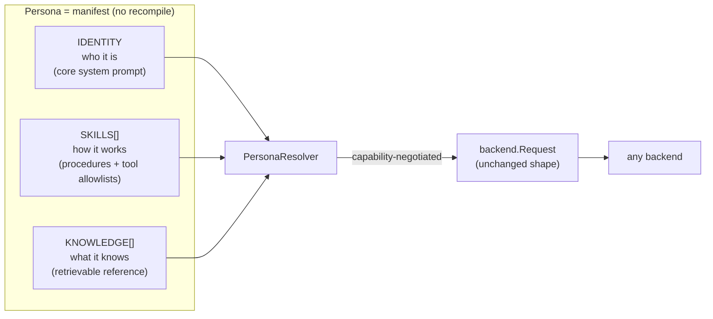
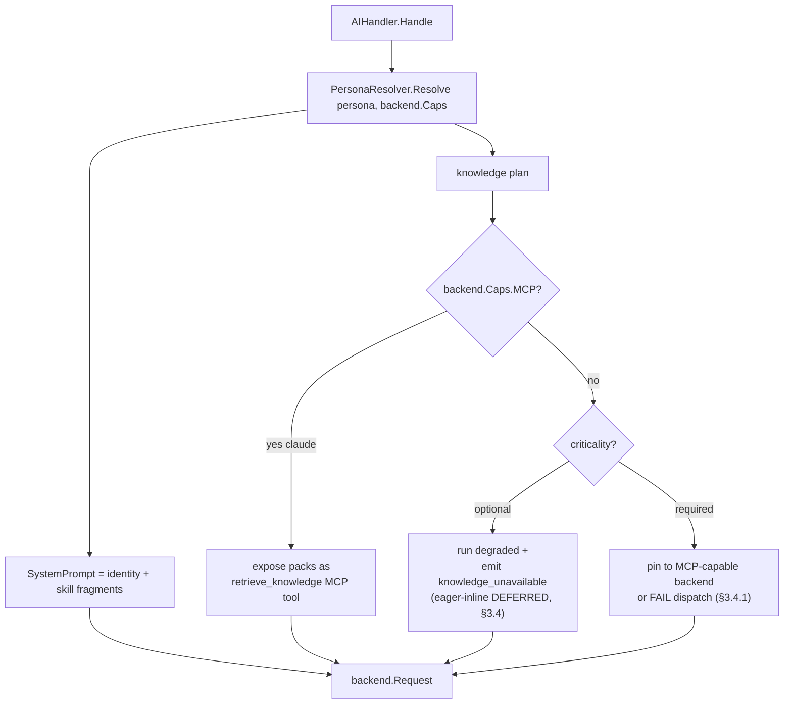
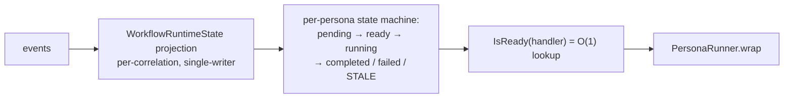
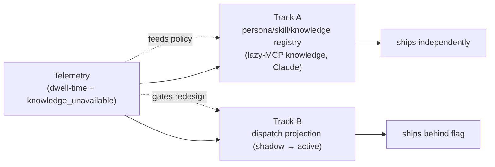

# Persona Extensibility & Dispatch Stability — Design Proposal

> **Status: PROPOSAL — not yet implemented.** This document describes a target
> design for review and sign-off. It does NOT reflect current runtime behavior.
> Current behavior lives in `architecture.md`. Do not treat interfaces or env
> vars here as live until a section is marked `Shipped`.

## 0. TL;DR

Three independent tracks, deliberately decoupled:

1. **Track A — Composable personas (registry).** A persona becomes a
   data-driven manifest composed of three layers — **identity / skills /
   knowledge** — loadable without recompile. This answers "no way to extend
   the personas" and "extend knowledge to extend operation mode."
2. **Track B — Dispatch projection.** Replace the per-dispatch full-chain
   replay in `checkJoinCondition` with a single-writer `WorkflowRuntimeState`
   read model. This addresses the class of silent-wedge instabilities.
3. **Telemetry (prerequisite for B).** Extend the existing `DispatchDropped`
   instrumentation with per-state dwell-time so Track B's redesign is
   data-driven, not incident-memory-driven.

A previously-considered fourth option — **migrating to the Claude Agent SDK** —
was **rejected**. Rationale in §10. The short version: no official Go Agent SDK,
the Agent SDK is Claude-only (it would delete the existing multi-backend
capability), and its subagent model has no equivalent of the DAG join +
feedback-loop semantics this system depends on.

The hard rule binding these tracks: **Track A must require zero changes to
`checkJoinCondition`.** Persona extensibility and dispatch stability share no
files. If they fuse, a dispatch regression blocks persona work that had no
reason to be coupled to it.

---

## 1. Problem Statement

Three distinct needs were raised together:

1. **Polish/extend persona prompts, with skills.** Today the 13 `pr-*`
   reviewers copy-paste boilerplate; there is no reuse mechanism.
2. **The dispatch/"redirect" system is too complex and has stability issues.**
   Workflows occasionally strand silently.
3. **Extend a persona's knowledge so one can extend its operation mode.** The
   same identity should behave differently given different domain knowledge,
   without authoring a new persona.

These are three problems with three different owners in the codebase
(`internal/persona` + `internal/handler` for 1 and 3; `internal/engine` for 2).
Treating them as one initiative is the primary scope risk (§9).

### Assumptions (call out if wrong — these invalidate the design)

- Multi-backend support (claude, codex, gemini, opencode, antigravity) is a
  **retained requirement**, not legacy. *(If false, the trade-off space changes
  substantially — but per the §10 analysis, abandoning it buys little.)*
- Operators are willing to curate per-repo knowledge packs on local disk,
  consistent with the existing `RICK_QUALITY_MANIFESTS_DIR` model.
- The event-sourced core (SQLite event store, bus, projections) stays.

---

## 2. Constraints

| Constraint | Source | Implication |
|---|---|---|
| **Multi-vendor backends** | Existing `backend.Backend` interface drives 5 CLIs | Any persona/knowledge delivery must degrade per backend capability, not assume Claude. |
| **MCP is Claude-only** | Backend capability matrix (only claude passes `--mcp-config`) | Progressive-disclosure knowledge (tool-retrieved) only works on Claude. Other backends need eager inlining or no knowledge. |
| **Choreography discipline** | Project invariant: no orchestration disguised as choreography | The dispatch projection must be a *derived read model*, not a central sequencer. Dispatch still flows through the bus. |
| **Platform consumed by N teams** | Org mandate | Backward compatibility and shadow-mode rollout are mandatory, not optional. |
| **Per-repo operator-local config** | Chosen knowledge-scope model | Knowledge packs live alongside `RICK_QUALITY_MANIFESTS_DIR`, not in the rick repo. |
| **Single Go binary** | Deploy model (systemd, `.deb`) | No new runtime (no TS/Python sidecar) without explicit justification. Rules out the Agent SDK. |

Consistency model: the dispatch projection is **read-your-writes within a single
correlation** (single-writer per correlation), eventually consistent across
correlations — which matches the current event-application model.

---

## 3. Proposed Solution

### 3.1 The three-layer persona model

A persona today is one flat system-prompt `.md` bound in Go. It decomposes into
three axes that change independently:



| Layer | Question | Mutates behavior? | Shared? | Example |
|---|---|---|---|---|
| **Identity** | Who am I? | Defines it | No (1:1 persona) | "You are a release engineer." |
| **Skill** | How do I do X? | Yes — active procedure | Yes | `diff-grounding`, `conventional-commit` |
| **Knowledge** | What do I know? | Indirectly — informs | Yes (per-repo/domain) | `huli-go-conventions`, `payments-domain` |

**Operation mode = identity × skills × knowledge, resolved at dispatch time.**
`developer` + `huli-go-conventions` behaves differently from `developer` +
`php-bff-conventions` — no new persona, no recompile.

### 3.1.1 Three levels of extensibility (scope honesty)

> Added in review: the original "drop a dir, restart" claim conflated three
> distinct capabilities. Only the first is in Phase-1 scope.

A workflow participant needs three things to *run*: a prompt (composition), a
constructed handler (registration), and DAG membership (topology). Manifests
address these to different degrees:

| Level | What it covers | Phase-1 scope | Why |
|---|---|---|---|
| **L1 — Prompt composition** | Override/compose identity + skills + knowledge for an **existing** registered handler | ✅ In scope, fully data-driven | No new handler or DAG node; resolves into the existing `backend.Request`. |
| **L2 — New AI persona** | Spawn a **new** `AIHandler` from a manifest, reusing the generic `aiCfg` construction, slotted into an **existing** DAG node | ⚠️ Constrained: feasible because AI handlers are uniform (`handlers.go` `aiCfg`), but requires a trusted handler-binding contract (§3.2.1) and an existing DAG slot to occupy | Handler is generic; the blockers are registration + a node to attach to, not handler logic. |
| **L3 — New deterministic handler / new DAG topology** | A non-AI handler with real Go logic, or a new/edited workflow graph | ❌ Out of scope | Deterministic handlers carry real logic (`workspace`, `quality-gate`, GitHub posters) — not expressible as a manifest. Topology lives in `selectWorkflowDef` + the `serve.go`/`mcp.go` registration loops; making it data-driven is a separate **workflow-manifest** track, deliberately deferred. |

**Phase 1 commits to L1**, with L2 as a stretch goal gated on the handler-binding
contract below. L3 is explicitly *not* promised. This keeps the
"add personas without recompile" claim honest: you can compose and re-skin
existing personas freely; standing up a genuinely new *kind* of participant or
rewiring the graph still needs code (or a future, separately-scoped track).

### 3.2 On-disk layout (SKILL.md format adopted as a schema)

The `SKILL.md` format (YAML frontmatter + markdown) is adopted as the manifest
schema. This is a **format adoption, not an SDK dependency** — it keeps a future
SDK door open at zero cost and is a well-documented schema.

```
# In the rick repo (global, versioned defaults):
internal/persona/personas/
  developer/SKILL.md
  pr-database/SKILL.md
internal/persona/skills/
  diff-grounding/SKILL.md
  conventional-commit/SKILL.md

# Operator-local, per-repo (NOT in rick repo) — chosen knowledge-scope model:
$RICK_KNOWLEDGE_DIR/<owner>/<repo>/
  huli-go-conventions/SKILL.md + chunks/*.md
  payments-domain/SKILL.md + chunks/*.md
```

Knowledge scope is **per-repo, operator-local**, mirroring
`RICK_QUALITY_MANIFESTS_DIR`. Resolution: `$RICK_KNOWLEDGE_DIR` →
`$XDG_CONFIG_HOME/rick/knowledge` → `$HOME/.config/rick/knowledge`.

#### Persona manifest schema (illustrative)

> Revised in review: the persona manifest owns **prompt composition only**. All
> runtime/safety knobs (`effort`, `verdict_bearing`, `phase`, and especially
> `Yolo`/`PlainText`/backend selection/timeout/target-persona) are **removed**
> from this layer — see §3.2.1 for why and where they live.

```yaml
---
schema_version: 1                     # enforced by startup validator from day one
name: developer
description: Staff engineer implementor; delivers minimal correct implementation.
identity: prompts/developer.md        # the core system prompt (existing file)
skills:                               # composed in declared order
  - diff-grounding
  - conventional-commit
knowledge:                            # resolved per-repo at dispatch
  - pack: huli-go-conventions
    load: always                      # delivery hint: always | on-demand
    criticality: optional             # required | optional  (see §3.4)
  - pack: payments-domain
    load: on-demand
    criticality: optional
---
# Optional inline identity body (if `identity:` file ref omitted)
```

#### 3.2.1 Handler-binding contract (the safety boundary)

The code review correctly flagged that several **safety-critical** behaviors are
configured today in Go handler construction (`internal/handler/handlers.go`),
not in prompt loading — verified:

- `PlainText=true` for verdict-bearing reviewers (`handlers.go:210,342`) — if
  off, `ExtractJSON` greedily steals in-prose JSON and corrupts verdict parsing.
- `Yolo=false` for `pr-replier` (`handlers.go:248-249`) — a text-only composer
  that must **not** get permission-skipping.
- Review backend selection + review timeout, `TargetPersona`, and the
  handler→phase template mapping.
- Per-persona `effort` (`personaEffort` map).

**If an operator-editable persona manifest could set these, a manifest edit
could silently disable a safety invariant** (flip `Yolo` on the replier, break
verdict parsing). Therefore:

| Contract | Owns | Trust / source | Phase 1 |
|---|---|---|---|
| **Persona manifest** | Prompt composition (identity, skills, knowledge refs) | Operator-editable, schema-validated | ✅ |
| **Handler binding** | `Yolo`, `PlainText`, `verdict_bearing`, backend, timeout, `TargetPersona`, phase/template, `effort` | **Go construction** (stays code) in Phase 1; if ever made data-driven, a *separate* trusted contract with stricter validation | Stays in Go |
| **Workflow manifest** | DAG topology | Deferred (L3) | ❌ |

Precedence rule: a persona manifest **cannot** set handler-binding fields; the
validator rejects unknown/forbidden keys loudly at startup. This preserves the
Track A / Track B decoupling *and* prevents safety bypass.

#### Skill manifest schema (illustrative)

```yaml
---
name: diff-grounding
description: Anchor every finding on a changed diff line; reject ungrounded claims.
tools: []                             # optional MCP tool allowlist (Claude only)
---
You must ground each finding on a specific changed line ...
```

### 3.3 Resolution pipeline & capability negotiation

The new `PersonaResolver` composes the layers and negotiates delivery against a
new `backend.Capabilities()` accessor. The `backend.Request` shape is
**unchanged** — this is the boundary that keeps Track A out of the dispatch
hot path.



New backend capability surface (the one honest extension the interface needs):

```go
// Capabilities reports optional features a backend supports, so the resolver
// can negotiate knowledge delivery and avoid sending no-op fields (MCPConfig,
// Effort) to backends that silently ignore them.
type Capabilities struct {
    MCP            bool // can retrieve knowledge via tool calls (progressive disclosure)
    SystemPrompt   bool // native --system-prompt flag (else XML-wrapped into user prompt)
    SessionResume  bool
    TokenAccounting bool
    ReasoningEffort bool
}

// Backend gains: Capabilities() Capabilities
```

This also fixes a current latent footgun: `MCPConfig` and `Effort` are
Claude-only `Request` fields that no-op on other backends with no signal.
Negotiation makes the gap explicit and loggable.

### 3.4 Knowledge delivery for non-Claude backends — DEFERRED

**Decision: defer the eager-inlining policy until telemetry exists.**

Phase 1 ships **lazy-on-Claude only**: knowledge packs are retrievable via MCP
on the Claude backend; on non-Claude backends knowledge is **unavailable and
the gap is logged** (a `knowledge_unavailable` structured event per persona
dispatch). We then measure, from real workflows, how often a non-Claude backend
ran a persona that declared knowledge packs, and whether output quality
suffered. Only then do we choose the eager policy (inline `always` packs vs.
inline a compressed index vs. build retrieval-for-all-backends/RAG).

Rationale: building eager inlining or RAG now is solving a scale/quality problem
we cannot yet quantify. The telemetry is cheap and de-risks the choice.

#### 3.4.1 Knowledge criticality — closing the "silent operation-mode" gap

Review flagged that deferring eager delivery leaves an **expectations** gap, not
just a perf one: with `operation mode = identity × skills × knowledge`, a
non-Claude backend silently dropping the knowledge layer means an operator can
believe they changed a persona's behavior while most backends ignore it. The
`criticality` field (§3.2) makes the contract explicit:

| `criticality` | Backend supports MCP | Backend does NOT support MCP (Phase 1) |
|---|---|---|
| `required` | deliver via MCP retrieval | **pin dispatch to an MCP-capable backend, or fail loudly** — never run degraded |
| `optional` | deliver via MCP retrieval | run degraded + emit `knowledge_unavailable` |

This makes the §3.4 deferral *safe*: until eager inlining exists, a `required`
pack simply constrains the persona to an MCP-capable backend (today: Claude) or
fails — it never silently no-ops.

> **Trade-off surfaced (real tension):** `required` knowledge on a *review*
> persona collides with backend rotation (`RICK_REVIEW_BACKENDS`,
> default `codex,opencode,claude`). Pinning to Claude defeats rotation diversity
> for that persona. The resolver must therefore intersect the rotation set with
> MCP-capable backends; if the intersection is empty, dispatch fails with a clear
> error rather than running blind. Operators choosing `required` knowledge on a
> rotated reviewer are explicitly trading rotation for knowledge — the validator
> should warn at startup so the choice is conscious.

### 3.5 Track B — dispatch projection

The instability source (per code map): `checkJoinCondition` **reconstructs**
readiness by replaying the full correlation chain through four parallel passes
(completions, verdicts, stale-guards, feedback-invalidation) on *every* dispatch
attempt, and every new semantic bolts another conditional onto the same
~150-line function. Every observed wedge was the same shape; each got a point
patch (advisory carve-out, barrier-sibling expansion, partial-review
absorption).

Target: a single-writer `WorkflowRuntimeState` projection that **is** the source
of truth for readiness.



```go
// Per-persona runtime state within one correlation. Single-writer (event apply).
type PersonaState struct {
    Phase         Phase   // pending | ready | running | completed | failed | stale
    LastTriggerID string
    Verdict       struct {
        Active      bool // outcome == fail
        Advisory    bool
        Fingerprint string
    }
    FeedbackCount int
    StaleSince    *time.Time // set on entry to stale; enables recovery/timeout + observability
}
```

What this buys, mapped to actual incidents:

| Incident / wedge | Today | With projection |
|---|---|---|
| Stale-guard never clears (target dies pre-completion) | invisible map entry, strands forever | explicit `stale` state with `StaleSince` → observable + recoverable |
| Advisory resume wedge | carve-out conditional in `checkJoinCondition` | one explicit transition |
| Barrier-sibling retry wedge | `PersonasToInvalidateFor` sibling expansion patch | projection invalidates barrier set atomically |
| O(N) full-chain load per dispatch on 13-way fan-out | store scan per attempt | projection read |

Stays within choreography discipline: the projection is **derived read-only
state**, not a sequencer. Dispatch still flows through the bus.

#### 3.5.1 Event contract: durable vs. ephemeral — CORRECTED after CLI review

> **Correction (supersedes the earlier "no new durable events" pushback).** An
> independent code-grounded review proved that claim **false**. Readiness does
> not depend only on completion/verdict/feedback events — it depends on the
> **WorkflowDef topology** (Graph, `RetriggeredBy`, `PartialReviewOnFailure`,
> consolidator config, env-driven mutations like quality-gate strip). That
> topology is **not in the durable log**: `WorkflowStartedPayload` carries only
> an ordered `Phases []string`, not the graph. A "pure fold over existing
> events" therefore cannot reconstruct consolidator bypass, the stale guard,
> partial-review absorption, or hook-expanded dependencies — it would silently
> diverge whenever the def changes between deploys.

The projection's inputs and durability, corrected:

| Input | Source | In durable log today? |
|---|---|---|
| completions / failures | `PersonaCompleted` / `PersonaFailed` | ✅ |
| verdict active/advisory/fingerprint | `VerdictRendered` | ✅ |
| feedback invalidation | `FeedbackGenerated` | ✅ |
| **retry invalidation** | **`WorkflowRetried.InvalidatedPersonas`** | ✅ (was omitted from the earlier plan — must be folded) |
| **workflow topology** | Graph/`RetriggeredBy`/`PartialReviewOnFailure`/consolidator | ❌ **not persisted** |
| `ready` / `running` | runner runtime fact | ❌ ephemeral (re-derived) |

**Required fix — snapshot the admission topology.** Persist a `WorkflowDef`
(or admission-rules) snapshot at `WorkflowStarted`, so the projection folds
against the topology *as it was when the workflow began*. The codebase already
establishes this exact pattern: the `WorkflowRetried` handler bakes
`InvalidatedPersonas` into its payload specifically "so replay doesn't depend on
the live WorkflowDef registry, which isn't attached until after Apply runs"
(`internal/engine/aggregate.go`). We extend the same discipline to the def
itself. With the snapshot, the projection **is** reconstructable from the log;
without it, it is not. `ready`/`running` remain ephemeral and re-derived.

This makes the projection robust to the **redeploy-divergence** hazard the
reviewers flagged: folding against a per-workflow snapshot, not the live
registry, means a topology change in a new build cannot retroactively change a
running correlation's readiness.

**`IsReady` is reader-relative.** `checkJoinCondition` already takes
`requestingHandler` and applies `isConsolidatorBypass(wfDef, requestingHandler,
predecessor)` — the same predecessor is "blocked" to a downstream handler but
"ready" to the review-consolidator. The projection therefore **cannot** store a
single static `Phase` that blocks all readers; it stores the raw verdict/feedback
state and `IsReady(requestingHandler, target)` applies the bypass at read time.

**Telemetry (separate concern):** non-AI handlers have no `started` signal, so
dwell-time telemetry adds a `DispatchStarted` observability event. Note the
`DispatchDropped` diagnostic is **not published on the bus** today (it is written
to a separate aggregate), so the dwell analytic reads that aggregate from the
store rather than subscribing — see task 0003.

#### 3.5.2 Idempotency, poison pills, and updater liveness (review: critical)

The code review's sharpest point: shifting readiness to a materialized projection
moves the single point of failure to the **projection updater**. If it
panics/stalls on a malformed event or under SQLite lock contention, the O(1) read
goes indefinitely stale — and `StaleSince` *cannot catch this*, because the
updater that would set it has itself stopped. Three mandatory mitigations:

1. **Pure-fold idempotency.** Apply is a pure function `(state, event) → state`,
   deduplicated by event ID/version. Replaying a batch (restart, outbox
   redelivery) cannot drift `FeedbackCount` or transitions — replay-from-zero
   yields identical state. This is also the rebuild mechanism: a corrupt
   materialized cache is discarded and refolded from the event log.
2. **Poison-pill quarantine.** A malformed/unparseable event does **not** panic
   the updater. It is skipped, and a `ProjectionApplyFailed{event_id, reason}`
   diagnostic is emitted. One bad event degrades one correlation, not the runner.
3. **Updater liveness (watch the watcher).** A `projection_apply_lag` metric
   (wall-clock between event append and projection apply) with an alert. This is
   the *only* signal that catches a dead/stalled updater — the failure mode
   `StaleSince` is blind to. Without it we would have replaced a visible wedge
   with an invisible one.

In **shadow mode** (§5) these are free to validate: divergence between projection
and legacy `checkJoinCondition` surfaces both logic bugs *and* updater stalls
before the projection is ever trusted for dispatch.

---

## 4. Backward Compatibility & Migration

### Track A — additive, dual-source registry

- The registry loads **both** Go-registered personas (current) and manifest
  personas. On name collision, **manifest wins** (operator override intent).
- Migrate in order of risk: **13 `pr-*` reviewers first** — they share one
  phase template, are review-only (no commit side effects), and carry the
  copy-paste pain. Then the non-verdict personas. Then `developer`/`committer`
  last (highest blast radius).
- No persona is forced to migrate; un-migrated personas keep their Go path.

### Track B — shadow mode, then flip

- Phase B0: projection runs in **shadow** — compute `IsReady` from *both* the
  projection and legacy `checkJoinCondition`, emit a `JoinDivergence` diagnostic
  event on mismatch, **act only on the legacy result**.
- Phase B1: once divergence is zero across real traffic for a sustained window,
  flip a flag to act on the projection. Legacy path retained.
- Phase B2: delete legacy only after a full release cycle clean.

---

## 5. Rollout & Rollback

| Track | Mechanism | Kill switch | Rollback time |
|---|---|---|---|
| Telemetry | Always-on, additive events | n/a (read-only) | n/a |
| Track A | `RICK_PERSONA_MANIFESTS_DIR` unset = manifests ignored, Go path only | unset env var + restart | seconds |
| Track A knowledge | `RICK_KNOWLEDGE_DIR` unset = no knowledge layer | unset env var | seconds |
| Track B | `RICK_DISPATCH_PROJECTION=off\|shadow\|active` (**default `off`**) | set to `off` + restart | seconds |

**Default = strict current behavior** (review correction). Track B defaults to
`off`. `shadow` is an **intentional opt-in** that is *not* current behavior: it
runs the projection updater and emits `JoinDivergence` diagnostics, so it carries
a real (bounded) compute + event-write cost. Operators enable `shadow`
deliberately during the validation window; `active` only after divergence==0.
Rollback is always `off`. No track is irreversible.

---

## 6. Observability

The telemetry track is the **prerequisite** for Track B and is independently
useful for triage.

- **Extend `DispatchDropped`** (already shipped) with **dwell-time per
  `(correlationID, persona, state)`**: how long a handler sits in
  `join_unsatisfied` / `pending_feedback` / `stale` before resolving or
  stranding. This is the data that tells us *which* wedge class still bites
  post-patches.
- **New `knowledge_unavailable`** structured event: persona declared knowledge
  but ran on a non-MCP backend (feeds the §3.4 deferred decision).
- **New `JoinDivergence`** diagnostic event: shadow-mode projection vs. legacy
  mismatch (gates Track B flip).
- **Metrics:** `dispatch_dwell_seconds{state,persona}` (histogram),
  `knowledge_unavailable_total{persona,backend}`,
  `join_divergence_total{persona}`, `persona_source{name,source=go|manifest}`.
- **Alert:** any correlation with a persona in `stale`/`pending_feedback` past
  an SLO threshold (the silent-wedge detector that has been missing).

---

## 7. Trade-offs

### Persona definition: Go-source vs. data-driven manifest

| Criterion | Go-source (today) | Manifest (proposed) |
|---|---|---|
| Add persona | 7 files + recompile + redeploy | drop a dir, restart |
| Compose/reuse | copy-paste | skill references |
| Type safety | compile-time | runtime validation needed |
| Operability | engineer-only | operator-curatable |
| **Verdict** | — | **Chosen** — recompile-to-extend is the stated pain |

Cost accepted: manifests need runtime schema validation (a startup linter that
fails loudly on malformed/unknown skill refs).

### Knowledge delivery: lazy-MCP vs. eager-inline vs. RAG

| Criterion | Lazy (MCP, Claude) | Eager inline | RAG (all backends) |
|---|---|---|---|
| Multi-backend | Claude only | all | all |
| Token cost | low | high | low |
| New subsystem | no | no | yes (embeddings/retrieval) |
| **Verdict** | **Phase 1** | **deferred** (§3.4) | **deferred, likely never** |

### Dispatch: patch-the-replay vs. projection

| Criterion | Keep patching `checkJoinCondition` | Projection read-model |
|---|---|---|
| Incremental cost | low per patch | high upfront |
| Wedge-class elimination | no (whack-a-mole) | yes (explicit states) |
| Observability of "stuck" | poor | built-in |
| **Verdict** | — | **Chosen, telemetry-gated, shadow-rolled** |

---

## 8. Blast Radius

- **Track A:** touches persona/handler registration, consumed by every
  workflow. Mitigated by dual-source additive loading — un-migrated personas are
  byte-for-byte unaffected. A malformed manifest fails that *one* persona at
  startup-validation, not the process.
- **Track A knowledge:** per-repo, operator-local — a bad pack affects only
  workflows on that repo, and only the personas that reference it.
- **Track B:** touches the hottest path (every dispatch). Mitigated by
  shadow-mode (acts on legacy until proven) — the highest-risk change is gated
  behind a divergence==0 proof. The relocated single-point-of-failure (the
  projection updater) is itself watched via `projection_apply_lag` + poison-pill
  quarantine (§3.5.2), so a stalled updater pages rather than silently stranding.
- **Who pages:** dispatch regressions strand workflows (operator-visible);
  persona-registry regressions fail a persona at startup (loud). The new
  stale/dwell alert **and** the `projection_apply_lag` alert mean silent strands
  — including a dead updater — become paged strands.

---

## 9. The Kill Shot (most likely failure)

**Scope fusion.** The single most likely way this fails is treating A+B+telemetry
as "the big rewrite" and entangling them — so a Track B dispatch regression
blocks Track A persona work that had no reason to depend on it, and the whole
effort stalls under one giant un-reviewable PR.

**Mitigation, enforced:** Track A resolves to the *existing* `backend.Request`
and the *existing* handler-registration path. It requires **zero diff** to
`checkJoinCondition` / `persona_runner.go` dispatch logic. The two tracks ship as
independent PRs against independent files. This boundary is a review gate, not a
guideline.

Secondary risk: manifest schema churn. Mitigated by a strict startup validator
and versioning the manifest `schema_version` from day one.

---

## 10. Rejected Alternative: Migrate to the Claude Agent SDK

Considered and rejected. The migration was the original framing ("migrate to an
agent SDK so we can reuse the backends"); research invalidated it on its own
terms.

> Review note: the rejection was narrowed. The Agent SDK *does* provide
> subagents, MCP, skills, hooks, and sessions — so the lead argument is **not**
> "it lacks orchestration." The decisive arguments are runtime/portability and
> what Rick would still have to keep regardless. The subagent point survives but
> is demoted: SDK subagents are not *event-sourced durable joins with feedback
> invalidation and recovery* — materially true, but not the headline.

Lead arguments (in priority order):

| Fact | Consequence |
|---|---|
| **No official Go Agent SDK** (Python/TS only; Go has only the low-level Client/Messages SDK) | Adopting it injects a Python/TS runtime into a single Go-binary deployment, or means shelling out to the `claude` CLI — which the system already does. |
| **Agent SDK is Claude-only** | "Reuse the backends" is impossible; it would **delete** multi-vendor support (codex/gemini/opencode/antigravity). |
| **Rick must keep its core regardless** | Even on the SDK, Rick still needs its event-sourced workflow lifecycle, durable DAG joins, feedback invalidation, retry, recovery, and the multi-backend adapter. The SDK replaces none of these. |
| (Secondary) SDK subagents ≠ durable event-sourced joins/feedback | reviewer ∥ qa parallelism, the consolidator barrier, and `FeedbackGenerated` re-triggers would be hand-rebuilt on top of the SDK, minus event sourcing. |

Refs: `code.claude.com/docs/en/agent-sdk/overview`,
`code.claude.com/docs/en/agent-sdk/subagents` (current docs confirm Python/TS
SDKs, subagents/MCP/skills/hooks/sessions; no Go Agent SDK).

**The backend layer is not the problem and not what the SDK would improve.** The
existing `backend.Backend` interface is already the correct multi-vendor adapter.

The one defensible SDK-adjacent move is **additive, not a migration**: add an
**API backend** implementing the existing `backend.Backend` interface via the
official Go Client SDK (`anthropic-sdk-go`), slotting next to the CLI backends in
the rotation for a non-CLI Claude path (real token accounting, fewer
stdout-parsing fragilities). This keeps multi-vendor, the event model, and the
single-binary deploy. Tracked as optional **Track C**, out of scope for Phase 1.

---

## 11. Sequencing



- **Parallel, week 0:** Telemetry + Track A (neither touches dispatch).
- **After telemetry data:** Track B in shadow, then active; eager-knowledge
  policy decided from `knowledge_unavailable` data.
- **Optional, later:** Track C (API backend).

---

## 12. Open Items / Decisions Locked

- Knowledge scope: **per-repo, operator-local** (locked).
- Eager-inlining for non-Claude: **deferred to telemetry** (locked); `required`
  knowledge pins to an MCP-capable backend in the interim (§3.4.1).
- This document: **design-doc-first**, impl plan derived after sign-off (locked).
- Track A Phase-1 scope: **L1 (prompt composition)** locked; **L2 (new AI
  persona via manifest)** stretch, gated on the §3.2.1 handler-binding contract;
  **L3 (deterministic handlers / DAG topology)** out of scope (§3.1.1).
- Still open: manifest `schema_version` evolution policy; the dwell-time SLO
  threshold for the stale + `projection_apply_lag` alerts (derive from telemetry
  baseline, not guessed); whether L2/L3 warrant a follow-up workflow-manifest
  track.

---

## 13. Review Dispositions (changelog)

This revision incorporates two independent reviews
(`*-review.md`, `code-review-*.md`). Dispositions:

| Finding | Disposition | Section |
|---|---|---|
| Track A overclaims runtime extensibility | Accepted — added 3-level taxonomy; Phase 1 = L1 | §3.1.1 |
| Manifest mixes identity with safety knobs | Accepted — split persona vs handler-binding contracts; safety stays in Go | §3.2.1 |
| Knowledge semantics vs multi-backend | Accepted — added `criticality: required\|optional` + rotation trade-off | §3.4.1 |
| Track B event contract underspecified | Partial pushback — readiness needs **no new durable events** (pure fold over existing); accepted durable-vs-ephemeral spec + `DispatchStarted` for non-AI dwell telemetry | §3.5.1 |
| Projection poison-pill / stalled updater (critical) | Accepted — quarantine + `projection_apply_lag` liveness + rebuild-from-log | §3.5.2 |
| Strict idempotency | Accepted — pure-fold keyed by event ID; replay-safe by construction | §3.5.2 |
| Rollout default contradicts rollback | Accepted — Track B defaults `off`; `shadow` is opt-in with stated cost | §5 |
| SDK rejection should narrow | Accepted w/ minor pushback — re-led on runtime/multi-backend/retained-core; subagent point demoted but kept (no durable event-sourced joins) | §10 |
| `schema_version` + statistical SLA threshold | Affirmed — already required; day-one enforcement | §3.2, §12 |
| (code-review) design targets `p99 < 200ms` | **Rejected** — no such SLO was set; §2 requires sourced latency targets, not invented ones. Not enshrined. | §2 |
